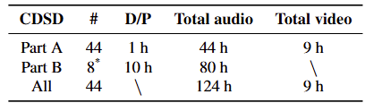
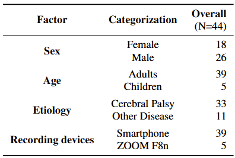

# Database Name

## Data Description
时长：包括 124 小时的音频数据和 9 小时的视频数据。根据每位受试者不同的录音时长，我们将该数据库分为两个部分。具体而言，A 部分包含来自全部 44 位说话者的 44 小时音频数据，每位说话者的录音时长为 1 小时。此外，它还包括与 9 位说话者的音频同步的视频录制内容。B 部分由 80 小时的音频数据组成，这些数据是 A 部分中 8 位说话者每人录制 10 小时的成果。汉语构音障碍语音数据库（CDSD）的详细信息列于表 1 中。

参与者：在数据收集的准备阶段，每位说话者在录音前都签署了知情同意书。总共招募了 44 名说话者，其中 39 名说话者年龄在 18 岁以上，其余 5 名说话者年龄在 18 岁以下。



## Data Partitioning
  8:1:1
- **Training Data**: Description of the training set.
- **Validation Data**: Description of the validation set.
- **Test Data**: Description of the test set.
- **Other Partitions**: Any additional subsets or special partitions.


## Results
Summarize any key findings, benchmarks, or results obtained using this database.
- **Performance Metrics**: If applicable, include metrics like accuracy, precision, recall, etc.
- **Benchmarks**: Comparison with other databases or models (if relevant).
- **Insights**: Highlight any notable insights or conclusions derived from the data.


## Citation
```plaintext
@inproceedings{wan24b_interspeech,
  title     = {CDSD: Chinese Dysarthria Speech Database},
  author    = {Yan Wan and Mengyi Sun and Xinchen Kang and Jingting Li and Pengfei Guo and Ming Gao and Su-Jing Wang},
  year      = {2024},
  booktitle = {Interspeech 2024},
  pages     = {4109--4113},
  doi       = {10.21437/Interspeech.2024-1597},
  issn      = {2958-1796},
}