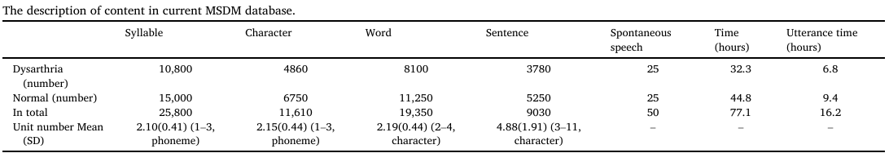

# Database Name

## Data Description
“普通话亚急性脑卒中构音障碍多模态数据库 （MSDM） 数据库”，其中包括来自 25 名亚急性脑卒中患者和 25 名健康参与者的视听数据。此外，还提供了每位患者的言语运动功能和生态心理的综合主观临床评估信息。


## Data Partitioning
- **Training Data**: Description of the training set.
- **Validation Data**: Description of the validation set.
- **Test Data**: Description of the test set.
- **Other Partitions**: Any additional subsets or special partitions.


## Results
Summarize any key findings, benchmarks, or results obtained using this database.
- **Performance Metrics**: If applicable, include metrics like accuracy, precision, recall, etc.
- **Benchmarks**: Comparison with other databases or models (if relevant).
- **Insights**: Highlight any notable insights or conclusions derived from the data.


## Citation
```plaintext
@inproceedings{wan24b_interspeech,
  title     = {CDSD: Chinese Dysarthria Speech Database},
  author    = {Yan Wan and Mengyi Sun and Xinchen Kang and Jingting Li and Pengfei Guo and Ming Gao and Su-Jing Wang},
  year      = {2024},
  booktitle = {Interspeech 2024},
  pages     = {4109--4113},
  doi       = {10.21437/Interspeech.2024-1597},
  issn      = {2958-1796},
}